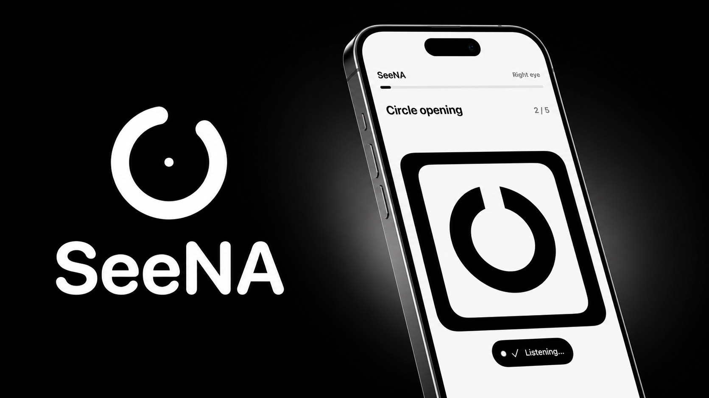
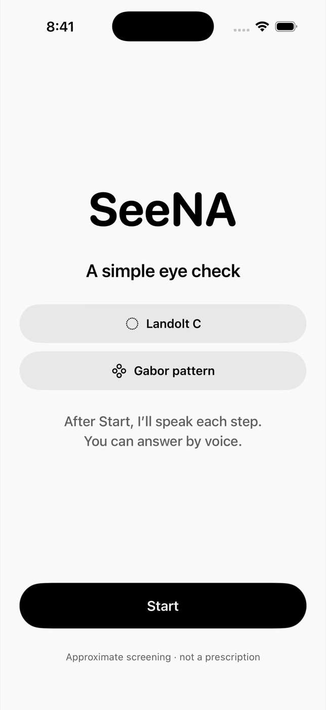
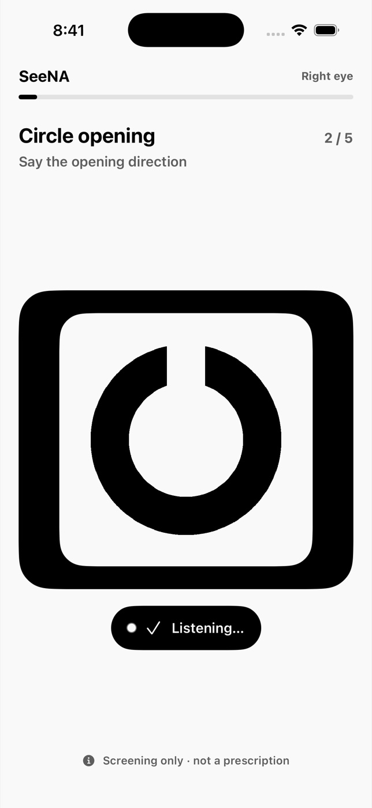
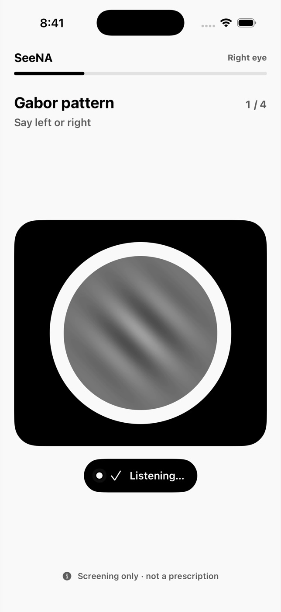
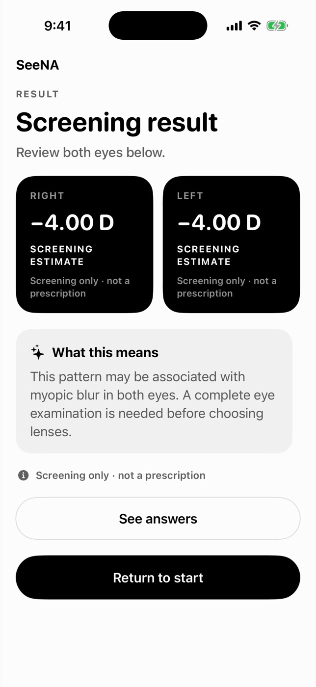
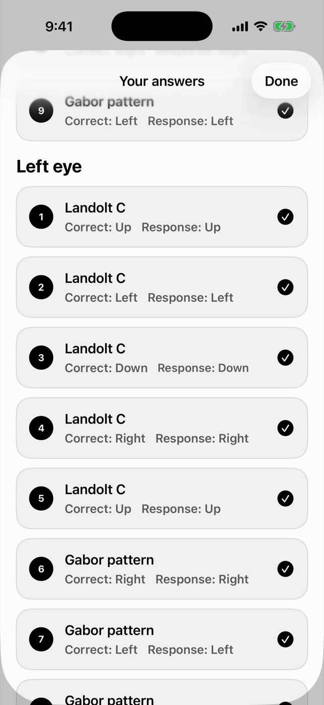
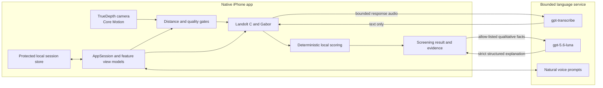

<p align="center">
  <a href="docs/assets/SeeNA-Product-Walkthrough-80s-Muted.mp4">
    
  </a>
</p>

<h1 align="center">SeeNA</h1>

<p align="center"><strong>See Now and Always</strong></p>

<p align="center">
  A voice-guided iPhone experience that makes vision screening feel simple, private, and approachable.
</p>

<p align="center">
  
  
  
  
  
</p>

SeeNA turns an iPhone into a guided vision screening companion. Place the phone securely, press Start, and follow natural spoken guidance. SeeNA helps the user reach the right position, presents one clear target at a time, listens for each answer, and explains the result in plain language.

The experience is designed for people who may not be wearing their glasses, may not be comfortable with technology, or may find conventional eye charts difficult to use alone.

## Watch SeeNA in action

<p align="center">
  <a href="docs/assets/SeeNA-Product-Walkthrough-80s-Muted.mp4"><strong>▶ Watch the complete 1 minute 20 second product walkthrough</strong></a>
</p>

The walkthrough is muted and follows the complete experience from launch, positioning, and both screening tasks through results and answer review.

## Why SeeNA

Vision screening often assumes that someone can read small instructions, position themselves precisely, and interact with a screen while their vision is already impaired. SeeNA removes that friction.

- Voice guidance begins only after the user presses Start.
- Clear step based cues help the user move closer or farther away.
- A stable readiness window prevents small natural movements from constantly resetting progress.
- One large target appears at a time, and SeeNA waits for the answer.
- Natural responses such as “left,” “up,” or “I cannot see it” are accepted.
- Short prompts, haptics, and subtle motion keep the experience calm and understandable.
- Each eye is screened independently, with a complete answer review at the end.

## The experience

1. **Open SeeNA.** A focused opening moment introduces the product without unnecessary instructions.
2. **Press Start.** Camera and microphone permissions are requested with concise explanations.
3. **Secure the phone.** Live face distance, gaze, lighting, and stillness feedback help create a reliable setup.
4. **Move into position.** Spoken guidance gives practical step based directions, confirms when to stop, then counts down “3, 2, 1, start.”
5. **Complete the Landolt C task.** Say the direction of the circle opening. The target changes only after SeeNA accepts the answer.
6. **Complete the Gabor task.** Identify the pattern orientation using the same one target, one answer rhythm.
7. **Understand the result.** SeeNA presents both eyes clearly, explains what the screening means, and lets the user compare every correct answer with the response that was heard.

<table>
  <tr>
    <td align="center"><br><sub>Start</sub></td>
    <td align="center"><br><sub>Landolt C</sub></td>
    <td align="center"><br><sub>Gabor</sub></td>
    <td align="center"><br><sub>Result</sub></td>
    <td align="center"><br><sub>Answer review</sub></td>
  </tr>
</table>

## How the screening works

### Landolt C

SeeNA presents a circle with a gap facing up, right, down, or left. The symbol is rendered directly from pixel controlled geometry, one at a time, with no bitmap scaling. Responses are accepted by voice and scored locally. The adaptive sequence searches for the smallest reliable target the user can identify under valid screening conditions.

### Gabor orientation

The second task presents a large striped pattern and asks for its orientation. It adds a complementary orientation response signal without asking the user to read letters or words. SeeNA reports this as an orientation task, not as a clinical contrast sensitivity diagnosis.

### Distance and eye power estimate

The front TrueDepth camera estimates eye to screen distance while Core Motion confirms that the phone is still. SeeNA combines metric face tracking with projected facial scale, filters outliers, and uses a rolling median to reduce visible fluctuation. A local deterministic relationship converts a validated far point distance into an estimated myopic spherical range:

```text
estimated diopters = -1 / distance in metres
```

Every measurement and number is produced by local code. Numeric output is only enabled when the exact iPhone has accepted physical calibration and the session passes distance, gaze, stillness, lighting, face, response, and evidence gates. SeeNA never invents a number when those conditions are not met.

The result is a screening estimate, not a medical diagnosis or eyeglass prescription. It does not replace a complete examination by an eye care professional.

## Technical architecture

SeeNA separates measurement from language. The iPhone owns sensing, rendering, scoring, and every numeric result. The backend is limited to bounded speech and explanation tasks.



| Layer | Responsibility |
| --- | --- |
| SwiftUI | Monochrome interface, restrained iOS 26 materials, motion, haptics, and accessible controls |
| MVVM | Feature focused view models isolate onboarding, permissions, readiness, screening, results, and history |
| AppSession | Owns navigation, the active screening session, sensor presentation state, and explanation state |
| ARKit and Core Motion | Estimate eye distance, head pose, gaze coverage, face count, and phone stillness |
| Rendering and scoring | Draw pixel aligned targets and calculate results with deterministic local code |
| Protected storage | Saves schema versioned sessions atomically on device with complete file protection |
| TypeScript service | Runs narrow authenticated endpoints for speech, transcription, and qualitative explanation |
| OpenAI | Transcribes bounded answers and returns schema constrained explanations with `store: false` and no tools |

The language model cannot create, change, or render a measurement number. If the service is unavailable, local scoring and deterministic result wording remain available.

## Trust and privacy

- Raw camera frames, face meshes, eye coordinates, and biometric templates are never retained or sent to OpenAI.
- Screening measurements and numeric results remain on the iPhone.
- Only bounded response audio and allow-listed qualitative result facts can cross the backend boundary.
- Sessions are written atomically to protected local storage and can be deleted in the app.
- The OpenAI API key remains server side and is never bundled into the iOS application.
- Remote responses use strict schemas, bounded inputs, rate limits, and deterministic fallbacks.

For the full engineering boundary, see [Technical architecture](docs/ARCHITECTURE.md) and [Validation protocol](docs/VALIDATION.md).

## Repository map

```text
SeeNA/       Native SwiftUI application
SeeNATests/  Measurement and state engine tests
server/      TypeScript language service for Vercel
docs/        Architecture, validation, and walkthrough assets
scripts/     Local configuration and media tooling
```

## Run SeeNA

### Requirements

- Xcode 26.6 or a compatible Xcode release
- iOS 26 or later
- A physical Face ID iPhone for TrueDepth, motion, microphone, and distance testing

The simulator supports interface and fallback testing. Physical sensor behavior requires a real iPhone.

### Open the app

```bash
git clone https://github.com/surtecha/SeeNA.git
cd SeeNA
open SeeNA.xcodeproj
```

Select the `SeeNA` scheme, choose an iPhone, and press Run.

### Connect the language service

Keep all secrets out of source control. After deploying `server/` to Vercel, configure the HTTPS URL and matching application token locally:

```bash
SEENA_BACKEND_URL=https://your-backend.vercel.app \
SEENA_APP_TOKEN=your-64-character-hex-token \
./scripts/configure-local-secrets.sh
```

To verify the backend locally:

```bash
cd server
npm ci
npm run check
```

## Verification

Run the deterministic Swift engines:

```bash
swift test
```

Compile the full iOS app:

```bash
xcodebuild \
  -project SeeNA.xcodeproj \
  -scheme SeeNA \
  -configuration Debug \
  -destination 'generic/platform=iOS Simulator' \
  CODE_SIGNING_ALLOWED=NO \
  build
```

Verify backend types, contracts, tests, and dependency health:

```bash
cd server
npm run check
npm audit --omit=dev
```

Continuous integration runs Swift tests, Debug and Release iOS builds, backend checks, and dependency auditing on every change to `main`.

## Validation boundary

SeeNA is built to fail safely. Simulator success cannot prove TrueDepth distance accuracy, microphone acoustics, or physical calibration. A numeric estimate remains locked unless the exact iPhone profile completes the physical calibration and evidence requirements in [docs/VALIDATION.md](docs/VALIDATION.md).

The current product is intended for research and screening. It does not assess every refractive condition or eye disease, cannot rule out a vision problem, and is not a substitute for professional eye care.

## Team

Built for **Syncs Hackathon 2026** by:

- [Karthik Ramesh](https://github.com/KarthikRamesh9149)
- [Kishore Srinivasan](https://github.com/SkinnyFatBoy05)
- [Suryateja Challa](https://github.com/surtecha)
- [Sujan Ramesh](https://github.com/sujansr)

## See now. Keep seeing always.

SeeNA imagines vision screening that starts with the device already in someone’s pocket, speaks when sight is limited, and turns a complicated process into a calm conversation.
