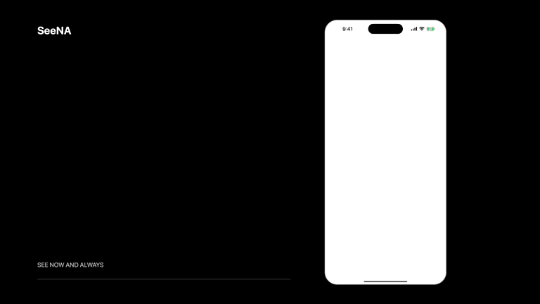
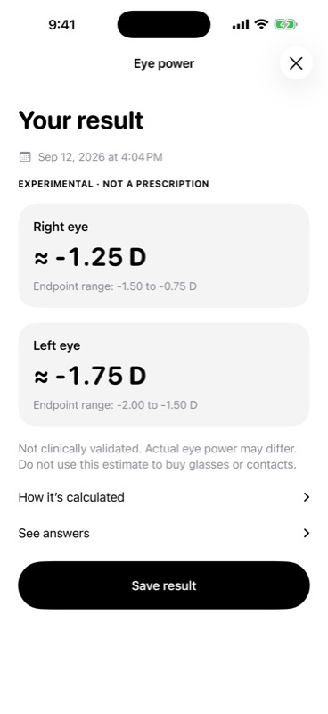
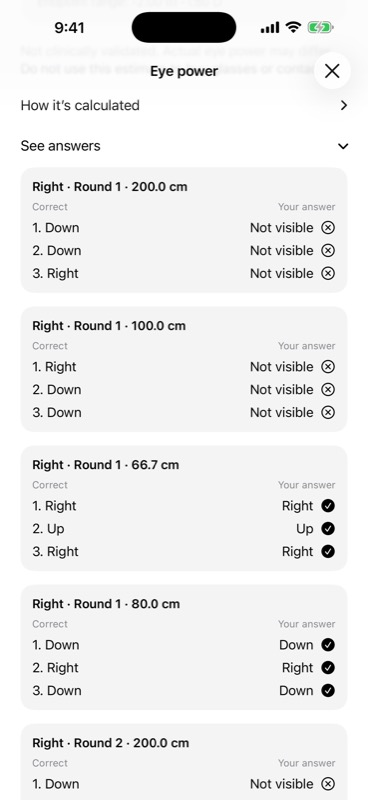
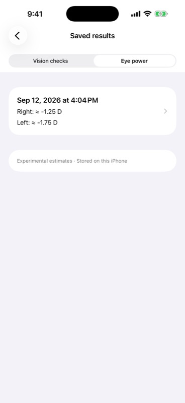
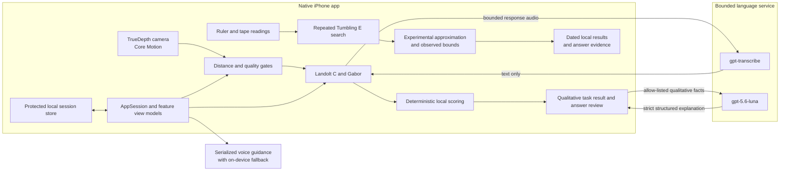

<p align="center">
  <a href="docs/assets/SeeNA-Launch-90s.mp4">
    
  </a>
</p>

<h1 align="center">SeeNA</h1>

<p align="center"><strong>See Now and Always</strong></p>

<p align="center">
  A calmer first step towards understanding your vision. Guided by voice. Saved for later.
</p>

<p align="center">
  
  
  
  
  
</p>

SeeNA turns an iPhone into a guided vision screening companion. Press **Start**, settle into position and answer out loud. One target. One question. Time to respond. At the end, see what you answered and return to your dated results whenever you need them.

For people exploring short sight, a separate **Eye-power estimate** experience adds a helper-assisted measurement using a ruler, a measuring tape and repeated clarity checks. It can show an experimental approximation when the readings support one, and asks for a repeat when they do not. It is not a prescription.

The experience is designed for people who may not be wearing their glasses, may not be comfortable with technology, or may find conventional eye charts difficult to use alone. It is especially mindful of older people and communities where reaching routine eye care may involve distance, travel, cost, or help from someone else.

## Watch SeeNA in action

<p align="center">
  <a href="docs/assets/SeeNA-Launch-90s.mp4">
    
  </a>
</p>

<p align="center">
  <strong><a href="docs/assets/SeeNA-Launch-90s.mp4">Watch SeeNA in 90 seconds</a></strong>
</p>

From a quiet welcome to one-at-a-time checks, an experimental estimate and saved results. The film uses the actual app interface with controlled simulator responses and edited timing. It demonstrates the experience, not a person's measured eye power or the duration of a complete physical measurement.

## Why SeeNA

For many people, an eye check is not close by. An older adult may depend on family for transport. Someone in a remote community may need to travel hours before they can even begin asking whether their sight has changed. Yet the first step is often built around small written instructions, a distant chart, and someone else operating the test.

SeeNA begins with something far more accessible: the iPhone already in a person’s hand. It turns setup into a spoken conversation and each task into one simple question at a time.

- Voice guidance begins only after the user presses Start.
- Clear step based cues help the user settle at the fixed 40 cm task distance.
- A stable readiness window prevents small natural movements from constantly resetting progress.
- One large target appears at a time, and SeeNA waits for the answer.
- Natural responses such as “left,” “up,” or “I cannot see it” are accepted.
- Short prompts, haptics, and subtle motion keep the experience calm and understandable.
- Each eye is screened independently through eight Landolt C targets and eight Gabor targets, with a complete answer review at the end.
- Dated results stay on the iPhone, with answer details and individual deletion.
- A separate helper-assisted mode explores approximate myopia without pretending that a circle-task score is a prescription.

## The experience

1. **Open SeeNA.** A focused, silent welcome introduces the product without speaking before the user is ready.
2. **Press Start.** Camera and microphone permissions are requested with concise explanations.
3. **Secure the phone.** Live face distance, gaze, lighting, and stillness feedback help create a reliable setup.
4. **Move into position.** Spoken guidance helps the user reach 40 cm, confirms when to stop, then counts down “3, 2, 1, start.”
5. **Complete the Landolt C task.** Say the direction of each circle opening. SeeNA waits for an accepted answer before changing the target.
6. **Complete the Gabor task.** Identify each pattern orientation using the same one target, one answer rhythm.
7. **Review the session.** SeeNA presents both eyes clearly, gives a carefully bounded plain-language explanation, and lets the user compare every correct answer with the response that was heard.
8. **Come back later.** Open Saved results to find previous vision checks by date. Experimental estimates have their own tab and an explicit Save result action.

<table>
  <tr>
    <td align="center"><br><sub>Start</sub></td>
    <td align="center"><br><sub>Landolt C</sub></td>
    <td align="center"><br><sub>Gabor</sub></td>
    <td align="center"><br><sub>Result</sub></td>
    <td align="center"><br><sub>Answer review</sub></td>
  </tr>
</table>

## A separate path to an approximate estimate

Choose **Eye-power estimate** from the welcome screen. Stay seated while a helper operates the phone.

1. **Set the screen scale.** Measure the on-screen line with a ruler.
2. **Measure the distance.** The helper places the phone between 40 cm and 2 m and enters the actual eye-to-screen tape reading.
3. **Find the clarity boundary.** Identify the direction of one small E at a time, or say that it is not visible. The helper repositions the phone between levels.
4. **Repeat for consistency.** Three independent searches run for each eye. Unbounded or inconsistent readings produce no number.
5. **Save the result.** Keep the date, observed range and every accepted answer together, locally on the iPhone.

Unlike the large circle and pattern tasks, these targets maintain a fixed visual angle. Enlarging them for easier recognition would change the measurement. This mode needs a helper and physical measurements; it is not the hands-free, fixed-distance journey.

**The estimate is experimental and has not been clinically validated.** It is intended for adults with known short sight within the supported range. It does not measure astigmatism or long sight, cannot rule out eye disease and must not be used to buy glasses or contacts. Read [how the protocol works](docs/REFRACTION_RESEARCH.md).

<p align="center">
  
  
  
</p>

## How the screening works

### Landolt C

At a fixed 40 cm distance, SeeNA presents eight large circles for each eye, one at a time, with the gap facing up, right, down, or left. Every direction appears twice, and the next target waits for the current answer. The symbol is rendered directly from pixel-controlled geometry, with no bitmap scaling. Responses are accepted by voice, scored locally, and retained for answer review. The current phone presentation records performance on this task, not a clinical visual-acuity measurement.

### Gabor orientation

At the same fixed 40 cm distance, the second task presents eight large striped patterns for each eye, one at a time, and asks for each orientation. Four face left and four face right in a shuffled order. It adds a separate orientation response task without asking the user to read letters or words. The display is not luminance or contrast calibrated, so this result is not a contrast-sensitivity measurement or diagnosis.

### Distance and session quality

The front TrueDepth camera estimates eye-to-screen distance while Core Motion checks that the phone is still. SeeNA filters outliers and uses a rolling median so brief natural movement does not constantly reset the experience. Distance, face count, lighting, head pose, stillness, response timing, and answer quality feed deterministic evidence checks that decide whether a task response can be kept or should be repeated.

The circle/pattern journey reports task outcomes and an answer audit, not diopters. The separate experimental mode converts repeated clarity boundaries using inverse-distance geometry. Its observed range includes a tape-reading allowance, not the full uncertainty of clinical refraction. Neither mode diagnoses an eye condition or replaces an eye examination.

## Technical architecture

SeeNA separates measurement from language. The iPhone owns sensing, rendering, evidence checks, scoring, and every displayed task outcome. OpenAI never performs the screening or changes a score. Its language role is limited to bounded answer transcription and a tightly gated plain-language explanation.



| Layer | Responsibility |
| --- | --- |
| SwiftUI | Monochrome interface, restrained iOS 26 materials, motion, haptics, and accessible controls |
| MVVM | Feature focused view models isolate onboarding, permissions, readiness, screening, results, and history |
| AppSession | Owns navigation, the active screening session, sensor presentation state, and explanation state |
| ARKit and Core Motion | Estimate eye distance, head pose, gaze coverage, face count, and phone stillness |
| Rendering and scoring | Draw task targets, run the separate fixed-angle E search, and recompute results from retained evidence |
| Protected storage | Saves dated, schema-versioned records atomically on device with complete file protection |
| TypeScript service | Runs narrow request-checked endpoints for speech, transcription, and qualitative explanation |
| OpenAI | Transcribes bounded answers and returns schema constrained explanations from allow-listed qualitative facts with `store: false` and no tools |

The language model cannot create or change a score or a refraction estimate. An explanation is shown only when it passes local schema, number, terminology, and meaning checks. Experimental estimates use local explanations only; no AI verification is presented as medical validation. If the service is unavailable, helper answer controls and deterministic result wording remain available.

## Trust and privacy

- Raw camera frames, face meshes, eye coordinates, and biometric templates are never retained or sent to OpenAI.
- Task measurements and answer evidence remain on the iPhone.
- Only bounded response audio and allow-listed qualitative result facts can cross the backend boundary.
- Sessions are written atomically to protected local storage and can be deleted in the app.
- Saving an experimental estimate is an explicit choice. Its timestamp and answers remain together when reopened.
- The OpenAI API key remains server side and is never bundled into the iOS application.
- Remote responses use strict schemas, bounded inputs, rate limits, local safety checks, and deterministic fallbacks.

For the full engineering boundary, see [Technical architecture](docs/ARCHITECTURE.md) and [Validation protocol](docs/VALIDATION.md).

## Repository map

```text
SeeNA/       Native SwiftUI application
SeeNATests/  Measurement and state engine tests
server/      TypeScript language service for Vercel
docs/        Architecture, validation, and walkthrough assets
scripts/     Local configuration and media tooling
```

## Run SeeNA

### Requirements

- Xcode 26.6 or a compatible Xcode release
- iOS 26 or later
- A physical Face ID iPhone for TrueDepth, motion, microphone, and distance testing

A previous iOS 26.5 smoke matrix covered iPhone 14 through 17 and iPhone Air simulator size classes. The latest verification below is narrower. The simulator supports interface and fallback testing; physical sensing and ruler calibration require a real iPhone. The experimental estimate additionally needs a helper, ruler and measuring tape.

### Open the app

```bash
git clone https://github.com/surtecha/SeeNA.git
cd SeeNA
open SeeNA.xcodeproj
```

Select the `SeeNA` scheme, choose an iPhone, and press Run.

### Connect the language service

Keep all secrets out of source control. After deploying `server/` to Vercel, configure the HTTPS URL and matching application token locally:

```bash
SEENA_BACKEND_URL=https://your-backend.vercel.app \
SEENA_APP_TOKEN=your-64-character-hex-token \
./scripts/configure-local-secrets.sh
```

To verify the backend locally:

```bash
cd server
npm ci
npm run check
```

## Verification

Latest local verification, 12 September 2026:

- 208 Swift tests covering measurement logic, answer evidence, voice policy, persistence and HTTP retry behaviour, including 199 synthetic endpoint threshold cases within one sweep test
- 32 backend contract and safety tests in CI; the live Luna check is from the preceding verification
- Debug and Release iOS 26 builds
- Both-eye simulator journeys, answer review, explicit estimate saving and reopening the dated record in Release
- Welcome and saved estimates checked at the largest accessibility text setting

[App implementation CI: passed](https://github.com/surtecha/SeeNA/actions/runs/34677353733). See [release evidence](docs/RELEASE_CHECKS_2026-09-12.md) for the exact scope.

The preceding release also passed a 16 of 16 simulator launch matrix across iPhone 14 through iPhone 17 and iPhone Air, and signed installation on a physical iPhone 16. Those are historical checks, not evidence that the latest changes have completed physical sensor and microphone testing. The current candidate still needs the [physical validation checks](docs/VALIDATION.md).

Voice answers are now checked against their own sensor window before being scored. Failed attempts retain the same target and do not contaminate accepted retries. Long spoken responses wait for silence within a bounded recording window, and interrupted recordings are not scored as complete answers.

Run the deterministic Swift engines:

```bash
swift test
```

Compile the full iOS app:

```bash
xcodebuild \
  -project SeeNA.xcodeproj \
  -scheme SeeNA \
  -configuration Debug \
  -destination 'generic/platform=iOS Simulator' \
  CODE_SIGNING_ALLOWED=NO \
  build
```

Verify backend types, contracts, tests, and dependency health:

```bash
cd server
npm run check
npm audit --omit=dev
```

Continuous integration runs Swift tests, Debug and Release iOS builds, backend checks, and dependency auditing on every change to `main`.

## Validation boundary

SeeNA is built to reject unsupported results. Simulator success cannot prove TrueDepth distance accuracy, microphone acoustics, or physical calibration. The fixed-distance circle/pattern tasks retain their numeric-output lock. The independent experimental endpoint protocol can produce an approximation, but agreement with clinician refraction has not been measured. Engineering checks prove code behaviour, not clinical accuracy.

Published phone-based refraction methods are discussed in the [refraction research review](docs/REFRACTION_RESEARCH.md). They use different measurement protocols and do not establish the accuracy of SeeNA's current tasks.

Clinical comparison testing is not included in this build. The app does not assess every refractive condition or eye disease, cannot rule out a vision problem, and is not a substitute for professional eye care.

## Team

Built for **Syncs Hackathon 2026** by:

- [Karthik Ramesh](https://github.com/KarthikRamesh9149)
- [Kishore Srinivasan](https://github.com/SkinnyFatBoy05)
- [Suryateja Challa](https://github.com/surtecha)
- [Sujan Ramesh](https://github.com/sujansr)

## See now. Keep seeing always.

When distance, age, or access makes eye care harder to reach, the first step should not disappear. SeeNA imagines vision screening that starts with the device already in someone’s pocket, speaks when sight is limited, and turns a complicated process into a calm conversation.
